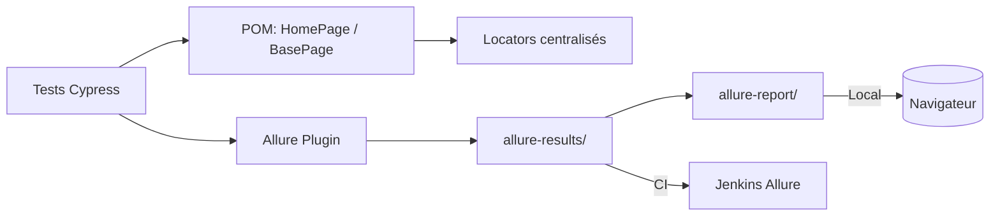

# Revers.io – Automatisation Cypress


Cadre de tests end‑to‑end pour le site Revers.io, basé sur Cypress + Allure, structuré en Page Object Model, et prêt pour l’intégration continue avec Jenkins. Conçu pour être lisible, maintenable et rapide à exécuter.

---

## 🧭 Sommaire

- **[Aperçu du projet](#-aperçu-du-projet)**
- **[Fonctionnalités clés](#-fonctionnalités-clés)**
- **[Prérequis](#-prérequis)**
- **[Installation](#-installation)**
- **[Utilisation](#-utilisation)**
- **[Rapports Allure](#-rapports-allure)**
- **[Structure du projet](#-structure-du-projet)**
- **[Pipeline Jenkins](#-pipeline-jenkins)**
- **[Bonnes pratiques](#-bonnes-pratiques)**

---

## ✨ Aperçu du projet

- Architecture **Page Object Model (POM)** claire et évolutive.
- **Allure** intégré: pièces jointes automatiques (captures, vidéo par spec), ouverture locale automatique, publication en CI.
- **Jenkinsfile** prêt‑à‑l’emploi (français) avec nettoyage, exécution headless, génération et publication du rapport.
- Tests **front** (navigation) et **API** (requêtes génériques via `makeApiRequest`).



> Astuce: en local, chaque spec terminée ouvre automatiquement le rapport. En CI, la publication est gérée par Jenkins (pas d’ouverture de navigateur).

## 🚀 Fonctionnalités clés

- **Cypress**: Tests E2E front et API rapides et fiables
- **POM**: Sélecteurs et actions réutilisables, maintenance simplifiée
- **Allure**: Vidéos attachées au dernier test de chaque spec + captures d’écran en échec
- **CI prête**: Pipeline Jenkins francisé et minimaliste

## 📋 Prérequis

- Node.js (v18 ou supérieur)
- npm (v8 ou supérieur)
- Allure CLI (pour les rapports)

## 🛠️ Installation

1. Cloner le repository:
```bash
git clone <repository-url>
cd reversio-cypress-automation
```

2. Installer les dépendances:
```bash
npm install
```

## 🎮 Utilisation

### Exécution des Tests

#### Exécuter tous les tests en mode headless:
```bash
npm run cypress:run
```

#### Exécuter les tests en mode interactif:
```bash
npm run cypress:open
```

#### Exécuter les tests sur un navigateur spécifique:
```bash
npm run cypress:run:chrome
npm run cypress:run:firefox
npm run cypress:run:edge
```

#### Exécuter un spec précis (ex: Frontend):
```bash
npx cypress run --spec cypress/e2e/frontend.cy.js
```

### Rapports Allure

#### Générer le rapport Allure (manuel):
```bash
npm run allure:generate
```

#### Ouvrir le rapport Allure:
```bash
npm run allure:open
```

#### Servir le rapport Allure:
```bash
npm run allure:serve
```

Note: en local, le rapport s’ouvre automatiquement à la fin de chaque spec grâce au hook `after:spec` dans `cypress.config.js`. En CI (Jenkins), l’ouverture automatique est désactivée et la publication est faite par le plugin Allure.

## 📁 Structure du Projet

```
cypress/
├── e2e/
│   ├── frontend.cy.js            # Tests Front
│   └── api.cy.js                 # Tests API
├── fixtures/
│   └── testData.json            # Données de test
├── support/
│   ├── commands.js             # Commandes personnalisées
│   ├── e2e.js                  # Bootstrap + Allure plugin
│   ├── locators/
│   │   └── HomePageLocators.js # Sélecteurs centralisés
│   └── pages/                  # Page Object Model
│       ├── BasePage.js        # Méthodes communes (click, navigate, API...)
│       └── HomePage.js        # Page d'accueil / navigation
├── screenshots/                # Captures d'écran
└── videos/                    # Vidéos des tests
```

## 🧪 Scénarios de Test

### Tests Frontend
- Vérification du chargement de la page
- Éléments de navigation
- Contenu de la section héro
- Design responsive (mobile, tablette, desktop)
- Métriques de performance
- Tests d'accessibilité
- Formulaire de contact avec validation

### Tests API
- Endpoints principaux
- Tests de sécurité
- Tests de performance
- Validation des données
- Tests d'intégration
- Gestion des erreurs

## 🔧 Pipeline Jenkins

Le pipeline `Jenkinsfile` (français) exécute:
- Nettoyage des anciens résultats
- `npx cypress run --browser chrome --headless --env allure=true`
- Génération du rapport Allure: `npx allure generate allure-results --clean -o allure-report`
- Publication via le plugin Allure Jenkins

Astuce: active le plugin "Allure Jenkins" et configure le chemin `allure-results`.

## ⚙️ Configuration

### Configuration Cypress
- URL de base: https://www.revers.io/fr
- Viewport: 1280x720
- Enregistrement vidéo: Activé
- Captures d'écran en cas d'échec: Activé
- Timeout par défaut: 10 secondes

### Configuration Allure
- Résultats: `allure-results/`
- Rapport: `allure-report/`
- Ouverture auto locale: activée après chaque spec (désactivée en CI)

## 🧭 Bonnes Pratiques

### Architecture
- **Page Object Model** clair
- **BasePage**: méthodes communes (navigation, interactions, API)
- **Locators** centralisés

### Qualité
- Scénarios en français
- Captures + vidéos en cas d’échec
- Rapport Allure riche (attachments)

### Intégration et DevOps
- **Pipeline Jenkins**: Automatisation complète du processus
- **Rapports Allure**: Visualisation professionnelle des résultats
- **Tests cross-browser**: Validation sur plusieurs navigateurs
- **Notifications**: Alertes automatiques par email

### Bonnes Pratiques
- **Code maintenable**: Structure claire et documentation
- **Gestion des erreurs**: Gestion robuste des échecs
- **Performance**: Tests de temps de chargement
- **Accessibilité**: Tests de conformité WCAG

## 📊 Conseils
- Lancer localement un seul spec lors du dev pour accélérer le feedback
- En CI, préférer le headless et Chrome stable

## 🚀 Conseils d’utilisation
- Local: `npx cypress run --spec cypress/e2e/frontend.cy.js`
- Forcer la régénération Allure: `npm run allure:generate && npm run allure:open`

## 📝 Notes pour l'Entretien

- **Expertise technique**: Démonstration de compétences avancées en automatisation
- **Pensée critique**: Analyse des besoins et conception de solutions
- **Communication**: Explication claire des concepts techniques
- **Innovation**: Utilisation d'outils modernes et de bonnes pratiques

## 🏷️ Système de Tags

- `@smoke`: Tests critiques
- `@critique`: Tests les plus importants
- `@négatif`: Tests négatifs
- `@sécurité`: Tests de sécurité
- `@performance`: Tests de performance
- `@accessibilité`: Tests d'accessibilité
- `@responsive`: Tests responsive
- `@navigation`: Tests de navigation
- `@contenu`: Tests de contenu
- `@contact`: Tests de formulaire de contact

## 📈 Bonnes Pratiques

### Page Object Model
- Classe séparée pour chaque page
- Sélecteurs d'éléments centralisés
- Méthodes réutilisables
- Utilisation de l'héritage

### Cucumber BDD
- Syntaxe Gherkin
- Tests lisibles par les métiers
- Définitions d'étapes
- Tables de données

### Gestion des Données de Test
- Utilisation des fixtures
- Données spécifiques à l'environnement
- Tests pilotés par les données

### Gestion des Erreurs
- Mécanisme de retry
- Assertions personnalisées
- Capture d'écran en cas d'échec
- Enregistrement vidéo

## 🔍 Débogage

### Débogage Cypress
```bash
npx cypress open
```

### Logs de Console
```javascript
cy.log('Message de débogage')
```

### Captures d'Écran
```javascript
cy.screenshot('capture-debug')
```

## 📞 Contact

Ce framework a été développé pour le poste de QA Lead chez Revers.io.

## 📄 Licence

Ce projet est sous licence ISC.