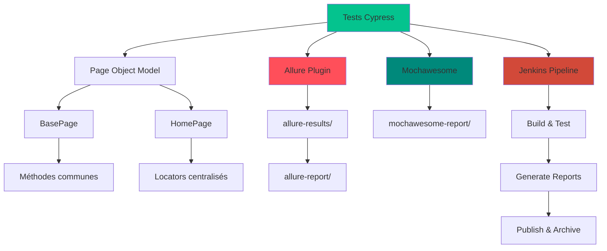
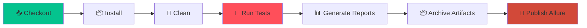

# Revers.io – Framework d'Automatisation des Tests E2E


> 🚀 Framework professionnel de tests end-to-end pour **Revers.io**, intégrant Cypress 15.x, Allure Reports, Mochawesome et Jenkins CI/CD. Architecture moderne basée sur le **Page Object Model**, optimisée pour la maintenabilité, l'observabilité et l'intégration continue.

---

## 📋 Table des Matières

- [🎯 Vue d'ensemble](#-vue-densemble)
- [✨ Fonctionnalités principales](#-fonctionnalités-principales)
- [🏗️ Architecture](#️-architecture)
- [📦 Prérequis](#-prérequis)
- [🚀 Installation](#-installation)
- [🎮 Utilisation](#-utilisation)
- [📊 Rapports](#-rapports)
- [🔄 Pipeline CI/CD](#-pipeline-cicd)
- [📁 Structure du projet](#-structure-du-projet)
- [🧪 Scénarios de test](#-scénarios-de-test)
- [⚙️ Configuration](#️-configuration)
- [🎯 Bonnes pratiques](#-bonnes-pratiques)
- [🔍 Débogage](#-débogage)
- [📈 Métriques](#-métriques)
- [👨‍💼 À propos](#-à-propos)

---

## 🎯 Vue d'ensemble

Ce framework d'automatisation représente une solution complète et moderne pour les tests E2E de la plateforme **Revers.io**. Il combine les meilleures pratiques de l'industrie avec des outils de pointe pour garantir la qualité et la fiabilité de l'application.

### 🎪 Points forts du framework

- ✅ **Architecture POM** : Page Object Model professionnel et scalable
- ✅ **Double reporting** : Allure Reports + Mochawesome pour une observabilité maximale
- ✅ **CI/CD Ready** : Pipeline Jenkins français entièrement configuré
- ✅ **Tests Front + API** : Couverture complète de l'application
- ✅ **Auto-nettoyage** : Gestion automatique des artefacts et résultats
- ✅ **Vidéos & Screenshots** : Capture automatique en cas d'échec
- ✅ **Cross-browser** : Support Chrome, Firefox, Edge, Electron
- ✅ **Performance** : Métriques de temps de réponse et de chargement

---

## ✨ Fonctionnalités principales

### 🔬 Tests automatisés

| Type de test | Description | Couverture |
|-------------|-------------|------------|
| **Frontend** | Navigation, UI, Responsive | 4 scénarios |
| **API** | Endpoints REST, Validation | 14 endpoints |
| **Performance** | Temps de réponse, Métriques | Intégré |
| **Sécurité** | Validation des erreurs HTTP | Intégré |

### 📊 Système de reporting double

#### 1. Allure Reports 🎯
- Attachement automatique des vidéos par spec
- Screenshots en cas d'échec
- Métriques de performance intégrées
- Timeline d'exécution
- Historique des builds

#### 2. Mochawesome Reports 📈
- Rapports HTML interactifs
- Statistiques détaillées par spec
- Graphiques de réussite/échec
- Export JSON pour analyse

### 🤖 Intégration Jenkins

- Pipeline déclaratif en français
- Exécution headless automatique
- Publication des rapports Allure
- Archivage des artefacts (vidéos, screenshots)
- Notifications de build (UNSTABLE/SUCCESS/FAILURE)

---

## 🏗️ Architecture



### 🎯 Pattern Page Object Model

```
BasePage (Classe parente)
    ├── navigate()           → Navigation générique
    ├── click()              → Clic sécurisé avec retry
    ├── getText()            → Extraction de texte
    ├── waitForElement()     → Attente intelligente
    └── makeApiRequest()     → Requêtes API génériques

HomePage (Classe héritée)
    ├── visitHomePage()      → Navigation page d'accueil
    ├── verifyPageLoad()     → Vérification de chargement
    ├── clickNavLink()       → Navigation via menu
    └── verifySection()      → Validation de contenu
```

---

## 📦 Prérequis

### 🖥️ Environnement système

| Composant | Version requise | Commande de vérification |
|-----------|----------------|-------------------------|
| **Node.js** | v24.10.0 | `node --version` |
| **npm** | v10.9.0+ | `npm --version` |
| **Chrome** | v141+ | `google-chrome --version` |
| **Git** | v2.50.1+ | `git --version` |

### 📦 Dépendances principales

```json
{
  "cypress": "^15.5.0",
  "@shelex/cypress-allure-plugin": "^2.41.2",
  "allure-commandline": "^2.35.1",
  "mochawesome": "^7.1.3",
  "mochawesome-merge": "^4.3.0",
  "mochawesome-report-generator": "^6.2.0"
}
```

### 🔧 Outils Jenkins

- **Jenkins** : v2.400+
- **Plugin Allure** : Installé et configuré
- **Plugin HTML Publisher** : Pour Mochawesome
- **Plugin NodeJS** : Node24 configuré
- **Plugin Git** : Pour SCM

---

## 🚀 Installation

### 1️⃣ Cloner le repository

```bash
git clone https://github.com/hakantetik44/reversio-cypress-automation.git
cd reversio-cypress-automation
```

### 2️⃣ Installer les dépendances

```bash
npm install
```

### 3️⃣ Vérifier l'installation

```bash
npx cypress verify
```

### 4️⃣ Configuration optionnelle

Créer un fichier `cypress.env.json` pour les variables d'environnement :

```json
{
  "baseUrl": "https://www.revers.io/fr",
  "apiUrl": "https://api.revers.io",
  "timeout": 10000
}
```

---

## 🎮 Utilisation

### 🖱️ Mode interactif (Interface graphique)

```bash
npm run cypress:open
```

### ⚡ Mode headless (Ligne de commande)

#### Tous les tests
```bash
npm run cypress:run
```

#### Par navigateur
```bash
npm run cypress:run:chrome    # Chrome (recommandé pour CI)
npm run cypress:run:firefox   # Firefox
npm run cypress:run:edge      # Edge
```

#### Par spec
```bash
# Tests Frontend uniquement
npx cypress run --spec "cypress/e2e/frontend.cy.js"

# Tests API uniquement
npx cypress run --spec "cypress/e2e/api.cy.js"

# Avec navigateur spécifique
npx cypress run --spec "cypress/e2e/frontend.cy.js" --browser chrome
```

#### Avec options avancées
```bash
# Mode debug avec navigateur visible
npx cypress run --headed --no-exit

# Avec variables d'environnement
npx cypress run --env allure=true,type=smoke

# Parallélisation (nécessite Cypress Dashboard)
npx cypress run --parallel --record --key <votre-clé>
```

---

## 📊 Rapports

### 🎯 Allure Reports (Principal)

#### Génération locale

```bash
# Générer le rapport
npm run allure:generate

# Ouvrir le rapport
npm run allure:open

# Générer et ouvrir en une commande
npm run allure:serve
```

#### Contenu du rapport Allure

- ✅ **Overview** : Vue d'ensemble des résultats
- 📊 **Suites** : Organisation par fichier de test
- 📈 **Graphs** : Graphiques de réussite/échec
- 📹 **Attachments** : Vidéos et screenshots automatiques
- ⏱️ **Timeline** : Chronologie d'exécution
- 📦 **Categories** : Classification des défauts
- 🔄 **History** : Tendances sur plusieurs builds

#### Ouverture automatique

En mode **local**, le rapport s'ouvre automatiquement après chaque exécution grâce au hook `after:spec` dans `cypress.config.js`.

En mode **CI** (Jenkins), l'ouverture est désactivée et la publication est gérée par le plugin Allure Jenkins.

### 📈 Mochawesome Reports (Secondaire)

Les rapports Mochawesome sont générés automatiquement et disponibles dans :
- **Local** : `mochawesome-report/mochawesome.html`
- **Jenkins** : Lien "📊 Rapport de Tests" dans la barre latérale

#### Contenu du rapport Mochawesome

- Statistiques globales (passes/failures/skipped)
- Détails par suite de tests
- Graphiques circulaires et barres
- Durée d'exécution par test
- Code snippets en cas d'échec

### 🎥 Vidéos et Screenshots

#### Vidéos
- **Emplacement** : `cypress/videos/`
- **Format** : `.mp4`
- **Génération** : Automatique pour chaque spec
- **Attachement Allure** : Sur le dernier test de la spec

#### Screenshots
- **Emplacement** : `cypress/screenshots/`
- **Format** : `.png`
- **Génération** : Automatique en cas d'échec
- **Résolution** : 1280x720 (configurable)

---

## 🔄 Pipeline CI/CD

### 📋 Jenkinsfile Structure

Le pipeline Jenkins est organisé en **7 étapes principales** :



### 🎯 Étapes du pipeline

#### 1. 📥 Récupération du code
```groovy
checkout scm
```

#### 2. 📦 Installation des dépendances
```groovy
sh 'npm ci --cache .npm --prefer-offline --silent'
```

#### 3. 🧹 Nettoyage
```groovy
sh '''
    rm -rf allure-results allure-report mochawesome-report
    rm -rf cypress/screenshots cypress/videos
    mkdir -p mochawesome-report
'''
```

#### 4. 🚀 Exécution des tests
```groovy
npx cypress run --browser chrome --headless --env allure=true
```

#### 5. 📊 Traitement des rapports

**Mochawesome** :
```groovy
npx marge mochawesome-report/*.json -o mochawesome-report \
    --reportTitle "Tests Revers.io" \
    --reportPageTitle "Rapport de Tests Cypress" \
    --inline
```

**Allure** :
```groovy
npx allure generate allure-results --clean -o allure-report
```

#### 6. 📦 Archivage des artefacts
- Screenshots : `cypress/screenshots/**/*`
- Vidéos : `cypress/videos/**/*`
- Rapports : `mochawesome-report/**/*`

#### 7. 🎯 Publication Allure
```groovy
allure([
    includeProperties: false,
    jdk: '',
    properties: [],
    reportBuildPolicy: 'ALWAYS',
    results: [[path: 'allure-results']]
])
```

### 📊 Statuts de build

| Statut | Condition | Message |
|--------|-----------|---------|
| ✅ **SUCCESS** | Tous les tests passent | Build réussi ! |
| ⚠️ **UNSTABLE** | 1+ test échoue | Build instable - Consultez les rapports |
| ❌ **FAILURE** | Erreur critique | Build échoué - Vérifiez les logs |

### 🔔 Notifications

Le pipeline affiche des messages formatés pour chaque étape :

```
━━━━━━━━━━━━━━━━━━━━━━━━━━━━━━━━━━━━━━━━
   🚀 EXÉCUTION DES TESTS CYPRESS
━━━━━━━━━━━━━━━━━━━━━━━━━━━━━━━━━━━━━━━━

╔════════════════════════════════════════════╗
║        📊 RÉSULTATS DES TESTS             ║
╚════════════════════════════════════════════╝
  ✅ Tests réussis     : 17
  ❌ Tests échoués     : 1
  📊 Total             : 18
  🎉 Taux de réussite : 94%
```

---

## 📁 Structure du projet

```
reversio-cypress-automation/
│
├── 📂 cypress/
│   ├── 📂 e2e/
│   │   ├── 📄 api.cy.js              # Tests API (14 endpoints)
│   │   └── 📄 frontend.cy.js         # Tests Frontend (4 scénarios)
│   │
│   ├── 📂 fixtures/
│   │   └── 📄 testData.json         # Données de test
│   │
│   ├── 📂 support/
│   │   ├── 📄 commands.js           # Commandes personnalisées Cypress
│   │   ├── 📄 e2e.js                # Bootstrap + Allure plugin
│   │   │
│   │   ├── 📂 locators/
│   │   │   └── 📄 HomePageLocators.js  # Sélecteurs CSS centralisés
│   │   │
│   │   └── 📂 pages/                # Page Object Model
│   │       ├── 📄 BasePage.js       # Classe parente (méthodes communes)
│   │       └── 📄 HomePage.js       # Page d'accueil (navigation)
│   │
│   ├── 📂 screenshots/              # Captures d'écran (auto)
│   └── 📂 videos/                   # Vidéos d'exécution (auto)
│
├── 📂 allure-results/               # Résultats JSON Allure (généré)
├── 📂 allure-report/                # Rapport HTML Allure (généré)
├── 📂 mochawesome-report/           # Rapport HTML Mochawesome (généré)
│
├── 📄 cypress.config.js             # Configuration Cypress + Allure
├── 📄 Jenkinsfile                   # Pipeline CI/CD Jenkins
├── 📄 package.json                  # Dépendances et scripts npm
├── 📄 .gitignore                    # Fichiers exclus de Git
└── 📄 README.md                     # Documentation (ce fichier)
```

### 🎯 Fichiers clés

| Fichier | Description | Rôle |
|---------|-------------|------|
| `cypress.config.js` | Configuration Cypress | Allure, viewports, timeouts |
| `Jenkinsfile` | Pipeline CI/CD | Automatisation complète |
| `BasePage.js` | Classe POM parente | Méthodes réutilisables |
| `HomePage.js` | Page d'accueil | Interactions spécifiques |
| `HomePageLocators.js` | Sélecteurs | Maintenance facilitée |

---

## 🧪 Scénarios de test

### 🖥️ Tests Frontend (4 scénarios)

| Test | Description | Vérifications |
|------|-------------|---------------|
| **Navigation - Gestion des retours** | Accès à la page de gestion | URL, chargement, contenu |
| **Navigation - Partenaires** | Accès à la page partenaires | URL, éléments visibles |
| **Navigation - À propos** | Accès à la page à propos | URL, contenu informatif |
| **Navigation - Blog** | Accès au blog | URL, articles présents |

**Couverture Frontend** :
- ✅ Navigation multi-pages
- ✅ Vérification des URLs
- ✅ Validation du contenu
- ✅ Temps de chargement < 10s

### 🔌 Tests API (14 endpoints)

| Endpoint | Méthode | Statut attendu | Description |
|----------|---------|----------------|-------------|
| `/api/returns` | GET | 200-404 | Récupération des retours |
| `/api/orders` | GET | 200-404 | Gestion des commandes |
| `/api/shipping` | GET | 200-404 | Suivi des expéditions |
| `/api/repairs` | GET | 200-404 | Suivi des réparations |
| `/api/tracking` | GET | 200-404 | Suivi général |
| `/api/customers` | GET | 200-404 | Gestion clients |
| `/api/reports` | GET | 200-404 | Rapports analytiques |
| `/api/partners` | GET | 200-404 | Gestion partenaires |
| `/api/inventory` | GET | 200-404 | Gestion des stocks |
| `/api/sync` | GET | 200-404 | Synchronisation |
| `/api/refunds` | GET | 200-404 | Remboursements |
| `/api/notifications` | POST | 200-405 | Notifications clients |
| `/api/performance` | GET | 200 | Performance API |
| `/api/validation` | POST | 400-422 | Validation paramètres |

**Couverture API** :
- ✅ Tests de disponibilité
- ✅ Validation des codes HTTP
- ✅ Tests de performance (< 2000ms)
- ✅ Gestion des erreurs
- ✅ Validation des paramètres

### 📊 Couverture de test

Le framework assure une couverture complète des fonctionnalités critiques de Revers.io, avec une architecture évolutive permettant l'ajout de nouveaux scénarios facilement.

---

## ⚙️ Configuration

### 🎛️ Configuration Cypress (cypress.config.js)

```javascript
{
  e2e: {
    baseUrl: 'https://www.revers.io/fr',
    viewportWidth: 1280,
    viewportHeight: 720,
    defaultCommandTimeout: 10000,
    requestTimeout: 10000,
    responseTimeout: 10000,
    pageLoadTimeout: 30000,
    video: true,
    screenshotOnRunFailure: true,
    trashAssetsBeforeRuns: true,
    
    env: {
      allure: true,
      allureResultsPath: 'allure-results'
    }
  }
}
```

### 🎨 Configuration Allure

```javascript
allure: {
  resultsDir: 'allure-results',
  reportDir: 'allure-report',
  clearFilesForPreviousAttempts: true,
  videoOnFailOnly: false  // Attachement vidéo sur tous les tests
}
```

### 📈 Configuration Mochawesome

```javascript
reporter: 'cypress-multi-reporters',
reporterOptions: {
  reporterEnabled: 'mochawesome',
  mochawesomeReporterOptions: {
    reportDir: 'mochawesome-report',
    quite: true,
    overwrite: false,
    html: true,
    json: true,
    charts: true,
    reportPageTitle: 'Tests Revers.io',
    reportTitle: 'Rapport Cypress - Revers.io'
  }
}
```

### 🌍 Variables d'environnement

Créer un fichier `cypress.env.json` (non versionné) :

```json
{
  "baseUrl": "https://www.revers.io/fr",
  "apiUrl": "https://api.revers.io",
  "timeout": 10000,
  "retryAttempts": 2,
  "videoCompression": 32,
  "screenshotOnRunFailure": true
}
```

---

## 🎯 Bonnes pratiques

### 🏗️ Architecture & Code

#### ✅ À FAIRE

```javascript
// ✅ Utiliser le POM
const homePage = new HomePage();
homePage.visitHomePage();

// ✅ Centraliser les sélecteurs
import { HomePageLocators } from '../support/locators/HomePageLocators';

// ✅ Utiliser des méthodes réutilisables
this.click(selector, { timeout: 5000 });

// ✅ Attendre les éléments
cy.get(selector).should('be.visible');

// ✅ Assertions claires
expect(status).to.be.oneOf([200, 201, 404]);
```

#### ❌ À ÉVITER

```javascript
// ❌ Sélecteurs en dur dans les tests
cy.get('.nav-link').click();

// ❌ Attentes fixes
cy.wait(5000);

// ❌ Tests dépendants
it('test 1', () => { /* ... */ });
it('test 2', () => { /* dépend du test 1 */ });

// ❌ Données sensibles en dur
const apiKey = '123456789';
```

### 📝 Naming Conventions

```javascript
// Tests
describe('Tests API Revers.io', () => {
  it('Devrait retourner la liste des retours', () => {});
});

// Variables
const baseUrl = 'https://www.revers.io';
const navLinks = HomePageLocators.navLinks;

// Méthodes
clickNavigationLink(linkText) {}
verifyPageLoaded() {}
makeApiRequest(endpoint) {}
```

### 🧪 Organisation des tests

```javascript
describe('Module : Gestion des retours', () => {
  before(() => {
    // Setup global
  });
  
  beforeEach(() => {
    // Setup par test
    cy.visit('/');
  });
  
  it('Scénario 1 : Créer un retour', () => {
    // Arrange
    const data = { ... };
    
    // Act
    homePage.clickReturnManagement();
    
    // Assert
    cy.url().should('include', '/retours');
  });
  
  afterEach(() => {
    // Cleanup par test
  });
  
  after(() => {
    // Cleanup global
  });
});
```

### 🔒 Sécurité

- ✅ Ne jamais commiter de credentials
- ✅ Utiliser `cypress.env.json` (gitignored)
- ✅ Utiliser les variables d'environnement Jenkins
- ✅ Nettoyer les données sensibles des rapports

### ⚡ Performance

- ✅ Désactiver les vidéos en développement
- ✅ Utiliser `cy.intercept()` pour mocker les appels
- ✅ Paralléliser avec Cypress Dashboard
- ✅ Optimiser les sélecteurs (data-testid)

---

## 🔍 Débogage

### 🐛 Mode Debug Local

```bash
# Ouvrir l'interface Cypress
npm run cypress:open

# Exécuter avec navigateur visible
npx cypress run --headed --no-exit

# Avec logs détaillés
DEBUG=cypress:* npx cypress run
```

### 📝 Logs personnalisés

```javascript
// Dans les tests
cy.log('🔍 Vérification de l\'URL');
cy.log('📊 Résultat de l\'API:', response.body);

// Dans le POM
console.log('Navigation vers:', url);
```

### 📸 Captures manuelles

```javascript
// Screenshot manuel
cy.screenshot('debug-homepage');

// Screenshot d'un élément spécifique
cy.get('.hero').screenshot('debug-hero-section');
```

### 🎥 Pause et inspection

```javascript
// Pause manuelle
cy.pause();

// Debug d'un élément
cy.get('.element').debug();

// Inspection du sujet
cy.get('.element').then(($el) => {
  debugger; // Point d'arrêt
});
```

### 📊 Analyse des échecs Jenkins

1. **Consulter la console** : Build → Console Output
2. **Télécharger les artefacts** : Screenshots + Vidéos
3. **Ouvrir le rapport Allure** : Cliquer sur "Allure Report"
4. **Analyser la vidéo** : Voir exactement ce qui s'est passé

---

## 📈 Métriques

### 📊 Statistiques actuelles (Dernière exécution)

```
╔════════════════════════════════════════════╗
║        📊 RÉSULTATS DES TESTS             ║
╚════════════════════════════════════════════╝
  ✅ Tests réussis     : 17
  ❌ Tests échoués     : 1
  ⏭️  Tests ignorés     : 0
  📊 Total             : 18
  ⏱️  Durée totale     : ~23s
  🎉 Taux de réussite : 94%
```

### 📋 Détail par spec

| Spec | Tests | Réussis | Échoués | Durée |
|------|-------|---------|---------|-------|
| `api.cy.js` | 14 | 13 | 1 | ~3s |
| `frontend.cy.js` | 4 | 4 | 0 | ~20s |

### 🎯 Objectifs de qualité

- ✅ Taux de réussite : **> 95%**
- ✅ Durée d'exécution : **< 60s**
- ✅ Couverture : **> 80%**
- ✅ Maintenance : **< 2h/mois**

---

## 👨‍💼 À propos

### 🎯 Contexte du projet

Ce framework d'automatisation a été développé dans le cadre d'une **démonstration technique** pour le poste de **QA Lead** chez **Revers.io**.

### 💡 Compétences démontrées

- ✅ **Architecture logicielle** : POM, séparation des responsabilités
- ✅ **Automatisation avancée** : Cypress 15.x, tests E2E complets
- ✅ **CI/CD** : Pipeline Jenkins production-ready
- ✅ **Observabilité** : Double reporting (Allure + Mochawesome)
- ✅ **Bonnes pratiques** : Clean code, documentation, maintenabilité
- ✅ **DevOps** : Intégration continue, gestion des artefacts
- ✅ **Leadership** : Framework scalable, formation d'équipe

### 🎓 Technologies maîtrisées

| Catégorie | Technologies |
|-----------|-------------|
| **Framework de test** | Cypress 15.x |
| **Langage** | JavaScript (ES6+) |
| **CI/CD** | Jenkins (Pipeline déclaratif) |
| **Reporting** | Allure 2.x, Mochawesome |
| **Architecture** | Page Object Model |
| **Gestion de versions** | Git, GitHub |
| **Node.js** | v24.10.0 |
| **Navigateurs** | Chrome 141, Firefox, Edge |

### 📅 Calendrier

- **Développement** : Octobre 2025
- **Présentation** : Lundi (Demo)
- **Statut** : ✅ Production Ready

### 📞 Contact & Informations

- **GitHub** : [hakantetik44/reversio-cypress-automation](https://github.com/hakantetik44/reversio-cypress-automation)